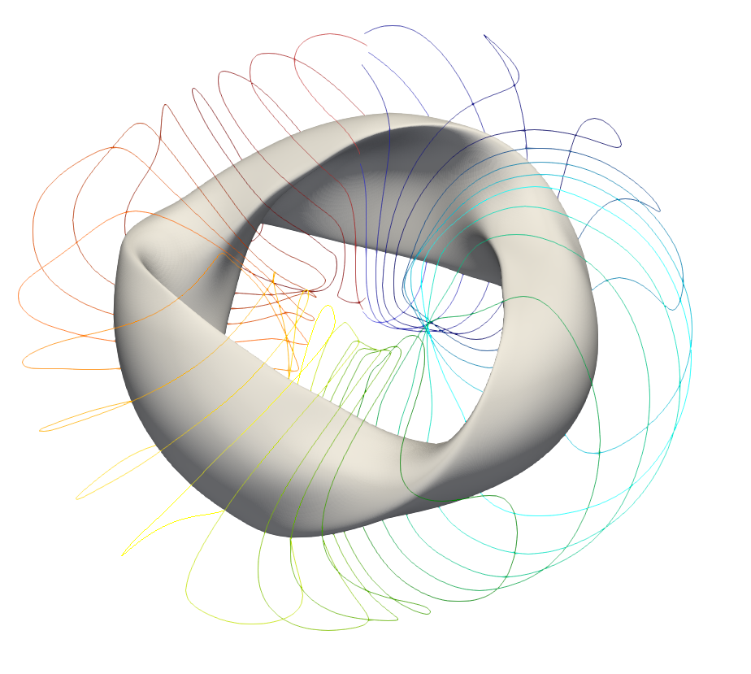

QUADCOIL documentation
======================

Welcome to the documentation for `QUADCOIL <https://github.com/lankef/quadcoil>`_, 
the stellarator coil complexity proxy/global coil optimizer!

QUADCOIL is a global coil optimization code that approximates coils with a smooth sheet current. 
In other words, it's a "winding surface" code. However, unlike other winding surface codes, QUADCOIL:

- Supports constrained optimization.
- Supports non-convex quadratic penalties/constraints, such as curvature 
  :math:`\mathbf{K} \cdot \nabla \mathbf{K}`.
- Includes robust winding surface generators that do not produce self-intersections.
- Calculates derivatives with respect to plasma shape, winding surface shape, objective weights, and constraint thresholds.

Installation
------------

QUADCOIL requires JAX. For the JAX installation guide, see `here <https://docs.jax.dev/en/latest/installation.html>`_. 

Clone the `QUADCOIL source files  <https://github.com/lankef/quadcoil>`_, 
and then run:

.. code-block:: bash

   pip install .

Validating the installation
------------------------------

The installation can be validated by running the example notebooks in ``examples``. 
The unit tests requires Simsopt's `regcoil` branch, which is not completely merged into
the main branch as of this writing. After installing the branch, run: 

.. code-block:: bash

    python -m unittest discover

Contact
-------

Please contact `Lanke Fu <mailto:ffu@pppl.gov>`_ at PPPL for questions and bug reports.

Publications
------------

1. `Global stellarator coil optimization with quadratic constraints and objectives <https://doi.org/10.1088/1741-4326/ada810>`_

.. toctree::
   :maxdepth: 1
   :caption: List of contents

   math
   tutorial_inputs
   tutorial_outputs
   tutorial_to_desc
   tutorial_to_simsopt
   quantity    
   quadcoil
